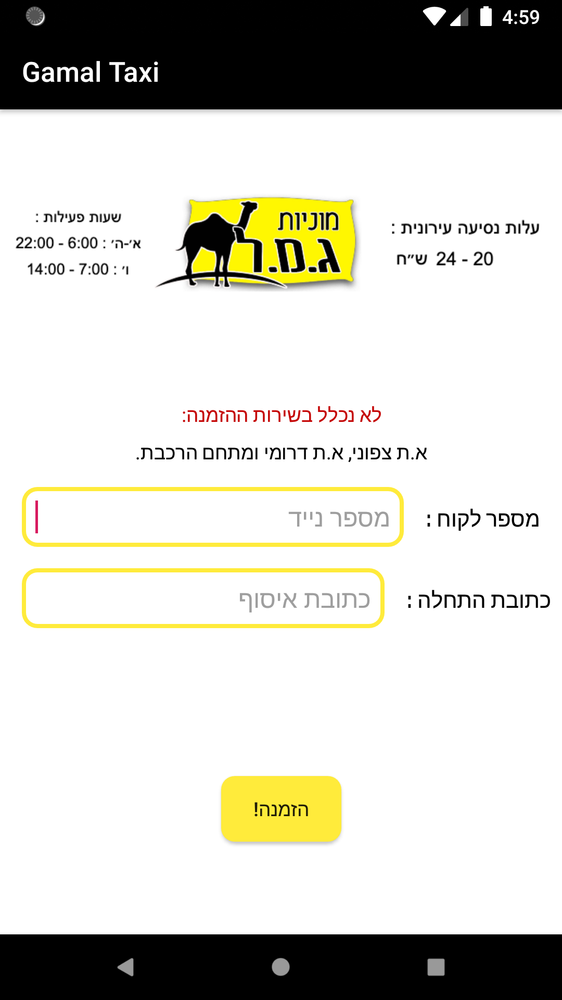
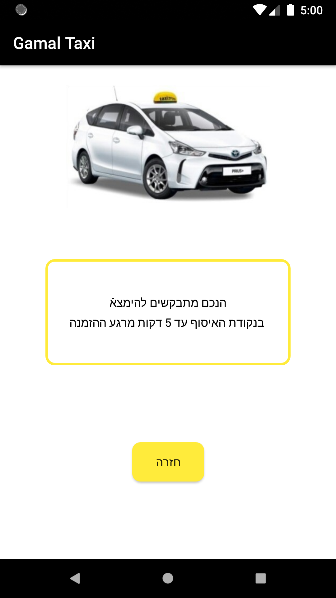
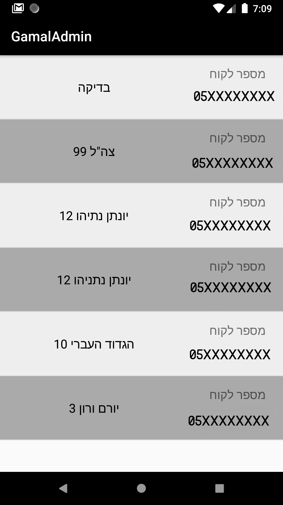

# Gamal-Taxi System

this system was built to help my client managing his orders.

my client owns a taxi company, and he wanted a simple system for his private clients to make their orers.

this what the system is about.

his company name is ג.מ.ל מוניות thats the meaning of the apps name.

app shots:

 

any client who wants to make an order need to write down their phone number so the admin will be able to reach them, and enter the departure address so the taxi driver will know where to take the client.

after the client wrote phone number and address he tap at "הזמנה" button, the data sent to its destination as JSON object, and the client moves to other page that contains a message for him.

the destination of the data the client wrote is the FireBase.
this app communicates with FireBase and saves the data that has been sent to it.

but it is only half of the way, there is an other application for admin where he can manage all the orders that sent to him.

repository link:
https://github.com/Damir2019/Gamal-Admin-App/tree/master

the admins application get all the order the clients sends on a real time database connected to the FireBase system.
the admin gets all the order as a list, as soon as the clients sends the order, it updates in FireBase database, and automatically updates admins application and add the order to his orders list.
then he can manage the order, send the texi driver and contact the client if needed.

more about the order app:
the order app works between the worktime hours.

between:

Sunday - Thursday : 6:00 to 22:00

Friday : 7:00 to 14:00

while the time is between the worktime the app is open to use and clients can make their orders.
if the time is out of the worktime range the app closes and clients cannot make orders, also a message appear in the order page says that "we dont work now".

validation:

all the fields must contain something inside of them else the order won't sent.

about admins app:

the admins app gets all the information from the FireBase realtime database system witch updates from order app
any changes made automatically updates the admins app orders list.

app shots:

*not real data* 

the admin can also delete order to clean the orders list by long click on a specific order opens a dialog window that ask "are you sure you want to delet?" with Yes and No button.

click NO the order stays.

click YES the order deleted from the orders list and also got deleted from the FireBase database system witch meant it will not show again.

this is my mini system :) hope you enjoyed!

